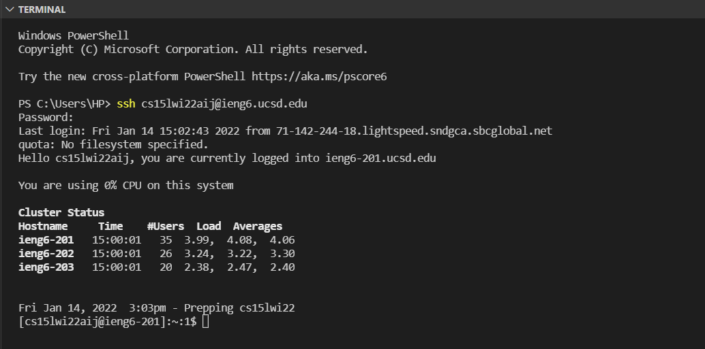
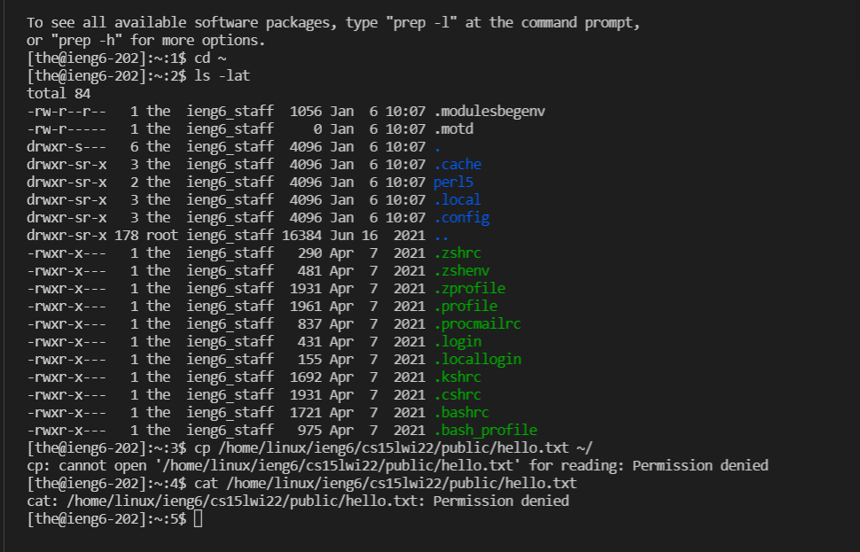
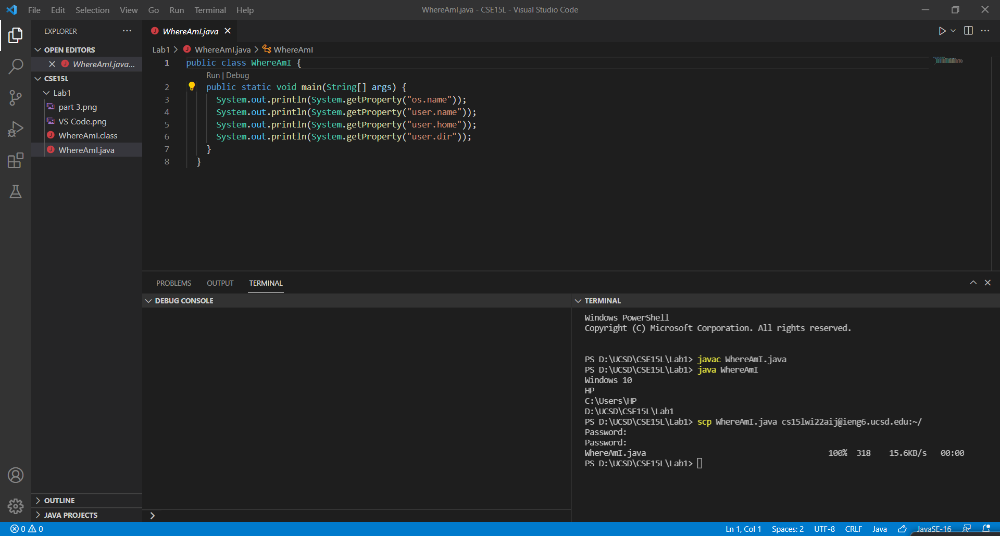

## Installing VScode
Go to the [Visual Studio Code website](https://code.visualstudio.com/), and follow the instructions to download it on your computer. 

After installing, you should be able to open a window that looks like this:

---
## Remotely Connecting
Install OpenSSH Client and Server on your windows.

Open **Settings**, select **Apps > Apps & Features**, then select **Optional Features**.

Then, you should look up your course-specific account [here](https://sdacs.ucsd.edu/~icc/index.php):

After finding your course-specific acount and changing password for it, we are going to connect to the remote computer using VSCode. Open a new command window enter `ssh cs15lwi22zz@ieng6.ucsd.edu` replace zz with your own username and follow the steps to entered your password. 

Once you logged in, your command window should look like this:

## Run some commands
Here are some specific useful commands to try:
* cd
* cd~
* ls -lat
* ls -a
* cp /home/linux/ieng6/cs15lwi22/public/hello.txt ~/
* cat /home/linux/ieng6/cs15lwi22/public/hello.txt

Here is my terminal running some commands:

To log out of the remote server in your terminal, you can use:

* Ctrl-D
* Run the command `exit`

## Moving Files over SSH with scp
Create a file on your computer called `WhereAmI.java`. Compile and run it on your computer use `javac` and `java`.

Then, in the terminal from the directory where you made this file, run this command
`scp WhereAmI.java cs15lwi22zz@ieng6.ucsd.edu:~/`

It should looks like:

## Setting an SSH Keys
Every time we log in or run `scp`, we have to type our password. There is a way to avoid this repetitve tasks called `ssh-keygen`.
The setup looks like this:

After this, I am able to `ssh` or `scp` from this client to the server without entering my password.

## Optimizing Remote Running

 Now I can for making a local edit to WhereAmI.java, then copying it to the remote server and running it.

I uses this command to log in and list the home directory on the remote server
 